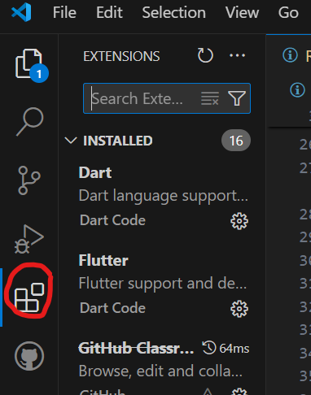

# SE-Assignment-5
Installation and Navigation of Visual Studio Code (VS Code)
 Instructions:
Answer the following questions based on your understanding of the installation and navigation of Visual Studio Code (VS Code). Provide detailed explanations and examples where appropriate.

 Questions:

1. Installation of VS Code:
   - Describe the steps to download and install Visual Studio Code on Windows 11 operating system. Include any prerequisites that might be needed.
   Download:
Go to code.visualstudio.com.
Download the installer for Windows.
 Run Installer:
Double-click the downloaded installer (.exe file).
  Follow Setup Wizard:
Accept the license agreement.
Choose installation options (default is usually fine).
Click "Next" through the wizard.
Install:

Click "Install" to begin installation.
Launch VS Code:

Once installed, launch VS Code from the Start menu or desktop shortcut.

2. First-time Setup:
   - After installing VS Code, what initial configurations and settings should be adjusted for an optimal coding environment? Mention any important settings or extensions.
    Install Extensions:
ESLint: For JavaScript/TypeScript linting.
Prettier: For code formatting.
GitLens: For Git integration.
Python: If working with Python.
IntelliCode: For AI-assisted code completions.
    Configure Settings:
Theme: Choose a preferred theme via Preferences: Color Theme.
Font Size: Adjust in Settings > Editor: Font Size.
Auto Save: Enable in Settings > Files: Auto Save.
Format on Save: Enable in Settings > Editor: Format On Save.
    Keybindings:
Customize shortcuts via Preferences: Open Keyboard Shortcuts.

3. User Interface Overview:
   - Explain the main components of the VS Code user interface. Identify and describe the purpose of the Activity Bar, Side Bar, Editor Group, and Status Bar.
     Activity bar:Provides icons for different views like Explorer, Search, Source Control, Run and Debug, Extensions.
     Side bar :Displays the selected view from the activity bar,like file explorer or search results. .
     Editor group:Main area where files are opened and edited..
     Status bar:shows information like line or column number,git branch,errors or warnings and language mode..
4. Command Palette:
   - What is the Command Palette in VS Code, and how can it be accessed? Provide examples of common tasks that can be performed using the Command Palette.
   The Command Palette is a versatile tool to quickly perform tasks and access features in VS Code.
         ACCESS.
   Menu 'view > command palette'.
         COMMON TASKS.
   Open settings
   Change theme.
   Install extensions.
   Run tasks.

5. Extensions in VS Code:
   - Discuss the role of extensions in VS Code. How can users find, install, and manage extensions? Provide examples of essential extensions for web development. 
       Role Of Extensions.
Enhanced Functionality:Extensions add features such as language support, debugging capabilities, code snippets, themes, and integration with various tools and frameworks.

Customization:Users can tailor VS Code to their specific workflows and coding preferences by installing extensions that provide additional functionalities not included in the core editor.
        HOW TO
        1) Find extensions.
        Open the vs code and you can find the extensions by clicking on the extension icon on the activity bar.
        Then use he search bar to find what you are looking for either in name,functionality or category.

        2)Installing
        Click on "Install" to install the extensions. ![alt text ] (<Javascript.png>)
        3)Managing 
        Once installed, extensions can be managed from the Extensions view .
        Enable, disable, uninstall, or update extensions as needed. Updates can be automatic or manually triggered.  
   Provide examples of essential extensions for web development.  javasript,html and css ,git intergration
Community Contributions:Extensions are often developed and maintained by the community, ensuring a wide range of options to cater to different programming languages, frameworks, and development environments.
6. Integrated Terminal:
   - Describe how to open and use the integrated terminal in VS Code. What are the advantages of using the integrated terminal compared to an external terminal?
     OPEN TERMINAL.
   Menu:'View >Terminal.
   Run shell commmands directly within vs code.
   Click on tht '+' to open mutliplte terminal tabs.
   Use dropdown to switch between terminals
      ADVANTANGE
   Stay within the same workspace without switchin windows.
   Easily split terminals and access the quickly.

7. File and Folder Management:
   - Explain how to create, open, and manage files and folders in VS Code. How can users navigate between different files and directories efficiently?
      CREATE
   Right click in the explorer sicebar and select 'New File or Folder'.
       OPEN
   File 'ctrl+o' and select your file.
   Folder 'ctrl+k or o'.
       MANAGE.
   Right click on tht file or folder to either rename or delete.
   Move file and folders by dragging them in the explorer.
       NAVIGATION
   Ctrl+P to optn filts by name.
   Ctrl+Tab to cycle through optn files.
   Ctrl+Shift to focus the explorer side bar. 
   F12 to jump to function or variable definition.

8. Settings and Preferences:
   - Where can users find and customize settings in VS Code? Provide examples of how to change the theme, font size, and keybindings.
   TO CHANGE THEME   
 Open Command palette .
 Type and select 'preferences:color theme.
 Choose theme you want eg black.
   FONT-SIZE.
Open settings.
Search for 'font-size'.
Set the font size you want.
   Changing keybindings.
Open keyboard shortcut by pressing 'ctrl+k or ctrl+s'
Search for the command you want to change.
Click on existing binding to edit and add a new one.

9. Debugging in VS Code:
   - Outline the d start debugging a simple program in VS Code. What are some key debugging features available in VS Code?steps to set up an
              SET UP AND START DEBUGGING.
    Open project on vs code.
    Set a breakpoint by clicking in the margin next  to a line number.
    Open the run and debyg view from the activity bar.
    Click 'tun and debug' and select your environment.
    Configurt the debugger if prompted by creating a 'launch.json' file.
       KEY POINTS TO DEBUGGING.
    Set breakpoints to pause execution
    Monitor variables and expressions.
    View the call stack to trace the execution flow.
    Inspect variaables values.
    Step controls and continue execution.
10. Using Source Control:
    - How can users integrate Git with VS Code for version control? Describe the process of initializing a repository, making commits, and pushing changes to GitHub.
First make sure you have installed or downloaded both  git and vs code on your Pc.
On vs code ensure that you have necessary extensions eg Github classroom,Github pull request.
Head to git hub and create your account.
Open your project folder via vs code,then head to source control view and click on 'InitializeRepository'.
Make changes to your file,stage the changes by clicking on a plus sign in the source control view and enter comit changes and click on checkmark to commit.
Crete a new repository to Github, add he remote on vs code git remote add origin https://github.com/your-username/your-repo.git and then push it.

 Submission Guidelines:
- Your answers should be well-structured, concise, and to the point.
- Provide screenshots or step-by-step instructions where applicable.
- Cite any references or sources you use in your answers.
- Submit your completed assignment by 1st July 

